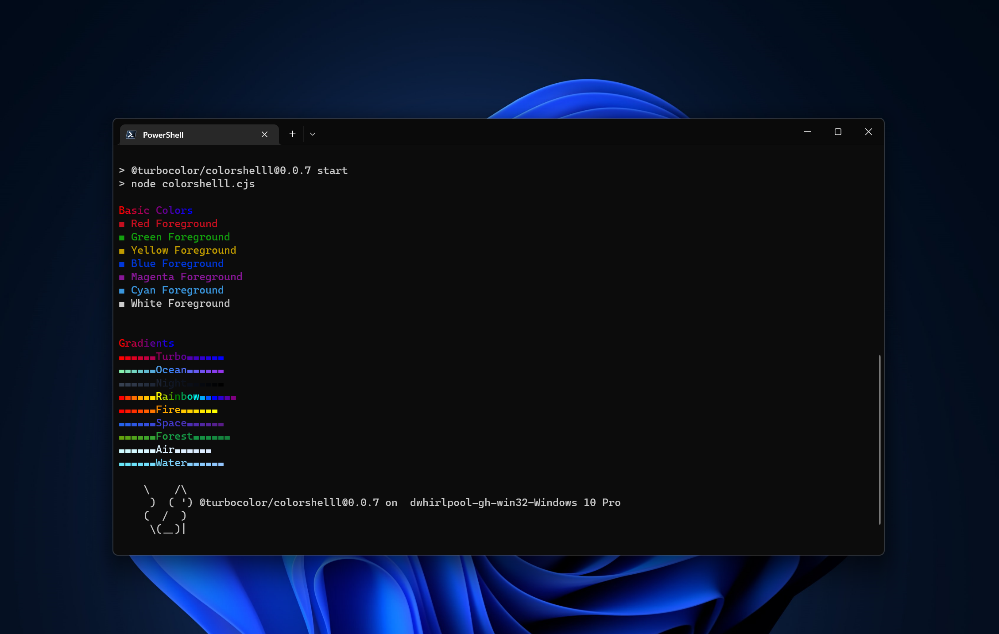

import Bleed from 'nextra-theme-docs/bleed'

# `colorshelll/colorsh`

**colorshelll** is a tool to Display colors and gradients In your command-line in a wide range of different programming languages

Here's what you will get in 1 minute:

<Bleed></Bleed>
